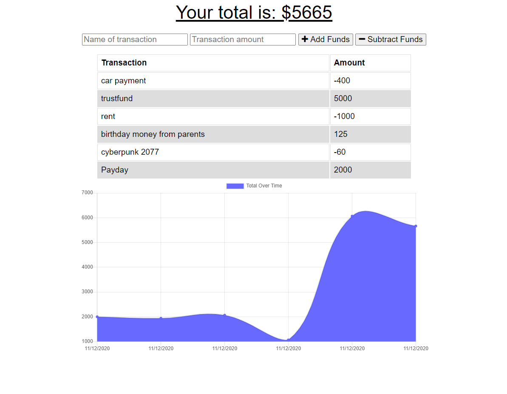

# firstPWA

The purpose of this website is to an convert an existing webapp into a Progressive Web Application, which allows the user to work within the app without an internet connect and it'll log the new information they inputting so that when they do get a connection, it'll add the info to the database and log it. 

## Prerequisites

Visual Studio Code was used to build. NodeJS, mongoose, and express were used. 

[Deploy Budget Tracker](https://glacial-spire-59532.herokuapp.com/)

Open the inspector tool, click on the Network tab, and change "Online" to "Offline". Add a few transactions. Turn it back to "Online" and hit refresh. All transactions added while Offline should stay when Online.

## Process/What was Changed

I had to add the service-worker.js file so I can add the files to cache so they would remain functional if the user were to lose connection. Then, I created a db.js file so I could store the information to a database so it could be brought back up if it was closed.

## Review

Once I understood how PWAs worked, this assignment was easier than I expected. I struggled alot during the assignments but then taking a step back, I saw pattens in other class assignments, and was able to implenment those same practices. Deploying on the otherhand was more difficult. But I was able to work my way through it one step at a time and got it done.  

- - -
© 2020 Lisa Worsham Services, Inc. All Rights Reserved.